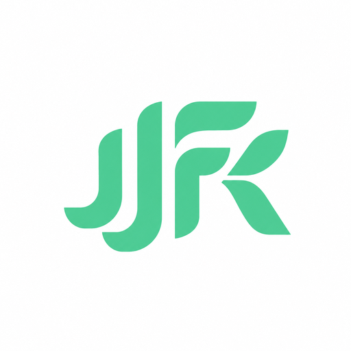
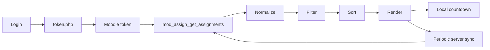

<div align="center">



# JJFK

### 전주대 과제확인

전주대학교 Cyber Campus의 과제를 한 화면에서 확인하기 위한  
**Liquid Glass 스타일의 설치형 PWA**입니다.

<br>


<br>

**빠르게 보고, 정확하게 갱신하고, 앱처럼 사용하기.**

</div>

---

## Overview

JJFK는 Cyber Campus의 Moodle Web Service를 이용해 로그인 토큰을 발급받고,  
사용자의 과제를 과목별로 정리하여 마감 순서와 남은 시간을 보여줍니다.

별도의 애플리케이션 서버를 두지 않고 브라우저에서 직접 동작하며,  
홈 화면에 추가하면 `standalone` PWA로 실행됩니다.

> [!NOTE]
> JJFK는 전주대학교 또는 Cyber Campus의 공식 애플리케이션이 아닌 개인 프로젝트입니다.

---

## Highlights

| | 기능 |
|---|---|
| **Assignment Feed** | 전체 과제를 과목별로 정리하고 가까운 마감부터 표시 |
| **Live Countdown** | 서버 요청과 분리된 로컬 시계로 남은 시간을 지속적으로 갱신 |
| **Server Sync** | 실행 중 Moodle API를 주기적으로 다시 조회하여 새 과제·마감 변경 반영 |
| **Pull to Refresh** | 최상단에서 의도적으로 당겨 즉시 서버와 다시 동기화 |
| **Elastic Edge** | 목록이 짧아도 iOS 앱처럼 끝단에 탄력감을 제공 |
| **Liquid Glass UI** | 큰 surface 중심의 반투명 glass material과 iOS 스타일 인터랙션 |
| **Standalone PWA** | 홈 화면 설치, 앱 아이콘, 오프라인 앱 셸 지원 |
| **Built-in Debug Backend** | 별도 mock 파일 없이 로그인부터 polling까지 전체 흐름 테스트 |

---

## How it works



실제 데이터 처리 흐름은 다음과 같습니다.

```text
로그인
  ↓
Moodle token 발급
  ↓
과제 API 요청
  ↓
응답 정규화
  ↓
표시 범위 필터
  ↓
마감순 정렬
  ↓
Liquid Glass UI 렌더링
```

---

## Refresh model

JJFK는 **시간 표시**와 **서버 동기화**를 분리합니다.

### Local clock

남은 시간은 서버 응답을 기다리지 않고 로컬 시계로 계산합니다.

```text
약 10초마다
Date.now()
  ↓
현재 화면의 남은 시간만 갱신
```

네트워크가 느려지거나 일시적으로 실패해도 이미 받아 둔 과제의 카운트다운은 계속 움직입니다.

### Moodle sync

실제 로그인 환경에서는 약 **60초마다** Moodle API를 다시 조회합니다.

```text
60초
 ↓
새 과제 확인
마감시간 변경 확인
삭제/변경된 데이터 반영
 ↓
화면 reconcile
```

앱이 다시 foreground로 돌아온 경우에도 현재 상태를 보정하도록 구성되어 있습니다.

### Pull to refresh

최상단에서 의도적으로 당기면 자동 polling을 기다리지 않고 즉시 API를 다시 호출합니다.

현재 제스처 기준:

```text
0 ───── 34px ───────────── 100px
│        │                   │
│        │                   └─ 100ms 유지
│        └─ refresh 의도 감지 시작
└─ 일반적인 elastic edge

전체 pull 동작은 최소 320ms 이상이어야 refresh로 확정
```

빠르게 스크롤하다 우연히 상단에 닿은 동작이 바로 새로고침으로 이어지지 않도록 분리되어 있습니다.

---

## Assignment state

과제는 현재 시각과 마감시간의 차이를 기준으로 상태가 계산됩니다.

- **Green** — 마감까지 여유가 있는 상태
- **Orange** — 마감이 가까운 상태
- **Red** — 매우 임박했거나 이미 마감된 상태

화면에는 현재 기준 **16일 이내의 과제**와 **마감 후 1일 이내의 과제**를 중심으로 표시합니다.

---

## Liquid Glass UI

JJFK의 glass는 모든 요소에 blur를 반복해서 거는 방식이 아닙니다.

```text
Course
└─ Liquid Glass Surface
   ├─ Assignment Row
   ├─ Assignment Row
   └─ Assignment Row
```

과목 단위의 큰 surface에만 glass material을 적용하고,  
내부 과제는 하나의 리스트처럼 구성하여 시각적 계층과 렌더링 비용을 함께 관리합니다.

주요 표현 요소:

- translucent surface
- backdrop blur
- restrained saturation
- specular highlight
- subtle rim
- touch feedback
- muted ambient background
- iOS safe-area 대응

---

## Built-in Debug Backend

별도의 `test-data.js` 없이 **실제 앱의 로그인 → token → API → normalize → filter → render → polling 흐름 전체**를 테스트할 수 있습니다.

디버그 모드에서는 **ID 칸에 예약어를 입력하고 비밀번호를 비워 둡니다.**

| ID | 동작 |
|---|---|
| `normal` | 일반적인 테스트 과제 |
| `massive` | 대량 과제로 렌더링·스크롤 스트레스 테스트 |
| `deadline` | 마감 경계값 집중 테스트 |
| `changes` | polling마다 추가·삭제·제목·마감시간 변화 |
| `slow` | 느린 서버 응답 에뮬레이션 |
| `flaky` | 주기적인 네트워크 실패와 복구 |
| `empty` | 과제가 없는 상태 |
| `malformed` | 일부 손상된 Moodle 응답 |
| `apierror` | Moodle API 오류 응답 |
| `loginfail` | 로그인 오류 UI |
| `help` | 디버그 예약어 안내 |
| `debug` | `normal`의 별칭 |

```text
ID: normal
PW: [비워 둠]
```

디버그 예약어는 Moodle 서버로 전송하지 않고 내부 backend에서 처리합니다.

---

## Installation

### iPhone / iPad

1. Safari에서 JJFK 페이지를 엽니다.
2. **공유** 버튼을 누릅니다.
3. **홈 화면에 추가**를 선택합니다.
4. 홈 화면의 JJFK 아이콘으로 실행합니다.

Standalone 모드에서는 일반 Safari 탭이 아니라 앱 형태로 실행됩니다.

> [!TIP]
> PWA 아이콘을 교체한 뒤 기존 홈 화면 아이콘이 그대로 남는 경우, 기존 PWA를 삭제한 뒤 다시 홈 화면에 추가하는 것이 가장 확실합니다.

---

## Project structure

```text
jjfk/
├─ index.html
├─ style.css
├─ app.js
├─ manifest.json
├─ service-worker.js
├─ README.md
└─ icons/
   ├─ icon-192.png
   ├─ icon-512.png
   └─ icon-maskable-512.png
```

### `index.html`

- 앱 shell
- 로그인 화면
- dashboard 구조
- safe-area / PWA metadata
- refresh indicator layer

### `style.css`

- Liquid Glass material
- color tokens
- responsive layout
- elastic refresh UI
- login / dashboard / toast 스타일

### `app.js`

- 인증
- Moodle API
- 데이터 정규화·필터·정렬
- 실시간 남은 시간 계산
- 서버 polling
- pull-to-refresh
- elastic edge
- debug backend

### `service-worker.js`

- 앱 shell 캐시
- HTML / JS / CSS `network-first`
- manifest / icon `cache-first`
- cross-origin Moodle 요청은 가로채지 않음

---

## API

JJFK는 Cyber Campus의 Moodle Web Service를 사용합니다.

### Token

```text
https://cyber.jj.ac.kr/login/token.php
```

서비스 이름:

```text
moodle_mobile_app
```

### Assignments

```text
https://cyber.jj.ac.kr/webservice/rest/server.php
```

Web Service function:

```text
mod_assign_get_assignments
```

---

## Privacy & security

JJFK에는 별도의 계정 데이터 서버가 없습니다.

- 입력한 학번과 비밀번호는 Moodle 토큰 발급 요청에 사용됩니다.
- **비밀번호 자체는 localStorage에 저장하지 않습니다.**
- 발급받은 Moodle token은 로그인 유지 용도로 브라우저 `localStorage`에 저장합니다.
- 로그아웃하면 저장된 token을 삭제합니다.
- Service Worker는 `cyber.jj.ac.kr`로 향하는 cross-origin 로그인/API 요청을 캐시하거나 가로채지 않습니다.
- 공용 기기에서는 사용 후 로그아웃을 권장합니다.

> [!WARNING]
> Moodle token은 계정 접근에 사용되는 인증 정보입니다. 브라우저 개발자 도구, 저장소 백업 또는 제3자 스크립트에 노출되지 않도록 주의해야 합니다.

---

## Cache strategy

```text
index.html
app.js
style.css
    │
    └── Network First
        └── 네트워크 실패 시 마지막 정상 캐시 사용

manifest.json
icons/*
    │
    └── Cache First
```

Moodle API 요청은 Service Worker의 캐시 대상에서 제외됩니다.

---

## Design principles

JJFK는 다음 기준을 유지합니다.

- 중요한 정보는 glass보다 선명하게
- 모든 요소를 둥근 카드로 만들지 않기
- backdrop blur는 큰 surface에 한정
- 시간 계산과 네트워크 동기화를 분리
- 서버 실패가 화면 전체 정지로 이어지지 않게 하기
- iOS의 native scrolling behavior를 가능한 한 유지
- 테스트 코드는 실제 데이터 처리 경로를 우회하지 않기

---

## Development

정적 파일 기반 프로젝트이므로 별도의 빌드 과정이 필요하지 않습니다.

```text
HTML + CSS + Vanilla JavaScript
```

HTTPS 환경에서 배포하면 PWA와 Service Worker 기능을 사용할 수 있습니다.

배포 후 코드가 변경되면 asset version과 Service Worker cache version을 함께 갱신하는 것을 권장합니다.

---

## Disclaimer

JJFK는 Cyber Campus를 더 편하게 확인하기 위한 개인 프로젝트입니다.

학교 또는 Moodle 서버의 API 정책, 응답 형식, 인증 방식이 변경되면 일부 기능이 동작하지 않을 수 있습니다.

---

## License / redistribution

현재 저장소에는 별도의 `LICENSE` 파일이 포함되어 있지 않습니다.

**명시적인 허가 없이 본 프로젝트의 전체 또는 일부를 재배포하는 것을 허용하지 않습니다.**

---

<div align="center">

**JJFK**

Made by `daxun` · [EnzoLisianthus](https://github.com/EnzoLisianthus)

</div>
